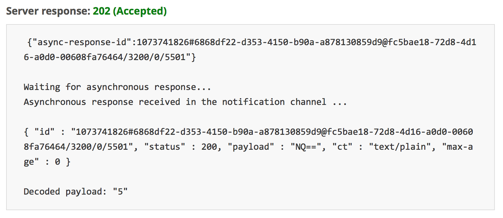

# Getting started with mbed Client on mbed OS

This is the mbed Client example for mbed OS (we also have one for [Linux](https://github.com/ARMmbed/mbed-client-linux-example)). It demonstrates how to register a device with mbed Device Connector, how to read and write values, and how to deregister. If you are unfamiliar with mbed Device Connector, we recommend that you read [the introduction to the data model](https://docs.mbed.com/docs/mbed-device-connector-web-interfaces/en/latest/#the-mbed-device-connector-data-model) first.

The application:

* Registers with mbed Device Connector.
* Gives mbed Device Connector access to its resources (read and write).
* Records the number of clicks on the device’s button and sends the number to mbed Device Connector.
* Lets you control the blink pattern of the LED on the device (through mbed Device Connector).

## Required hardware

* An [FRDM-K64F](http://developer.mbed.org/platforms/frdm-k64f/) board.
* An Ethernet connection to the internet.
* An Ethernet cable.
* A micro-USB cable.

## Required software

* An [ARM mbed account](https://developer.mbed.org/account/login/?next=/).
* [mbed-cli](https://github.com/ARMmbed/mbed-cli) - to build the example programs. To learn how to build mbed OS applications with mbed-cli, see [the user guide](https://github.com/ARMmbed/mbed-cli/blob/master/README.md).
* A [serial port monitor](https://developer.mbed.org/handbook/SerialPC#host-interface-and-terminal-applications).

## Setting up

To set up the example, please:

1. [Build the example](#Building-the-example).
1. [Set up an IP address](#IP-address-setup). This step is optional.
1. [Set a socket type](#Setting-socket-type). This step is optional.

### Building the example

To build the example application:

1. Clone [this](https://github.com/ARMmbed/mbed-client-quickstart-morpheus) repository.
1. Go to [mbed Device Connector](https://connector.mbed.com) and log in with your mbed account.
1. On mbed Device Connector, go to [My Devices > Security credentials](https://connector.mbed.com/#credentials) and click the **Get my device security credentials** button to get new credentials for your device.
1. Replace the credentials in `security.h` of this project's directory with content copied above.
1. Open a command line tool and navigate to the project’s directory.
1. Update mbed-os sources using the `mbed update` command.
1. Build the application by selecting the hardware board and build toolchain using the command `mbed compile -m K64F -t GCC_ARM`. mbed-cli builds a binary file under the project’s `.build` directory.
1. Plug the Ethernet cable into the board.
1. Plug the micro-USB cable into the **OpenSDA** port. The board is listed as a mass-storage device.
1. Drag the binary `.build/K64F/GCC_ARM/mbed-client-quickstart-morpheus.bin` to the board to flash the application.
1. The board is automatically programmed with the new binary. A flashing LED on it indicates that it is still working. When the LED stops blinking, the board is ready to work.
1. Press the **RESET** button on the board to run the program.
1. For verification, continue to the [Monitoring the application](#monitoring-the-application) chapter.

### IP address setup (optional)

This example uses IPv4 to communicate with the [mbed Device Connector Server](https://api.connector.mbed.com). The example program should automatically get an IPv4 address from the router when connected over Ethernet.

If your network does not have DHCP enabled, you have to manually assign a static IP address to the board. We recommend having DHCP enabled to make everything run smoothly.

### Changing socket type (binding mode - optional)

Your device can connect to mbed Device Connector via one of two binding modes: UDP or TCP. The default is UDP.

To change the binding mode:

1. In the `simpleclient.h` file, find the parameter `SOCKET_MODE`.
1. The default is `M2MInterface::UDP`.
1. To switch to TCP, change it to `M2MInterface::TCP`.

Then re-build and flash the application.

<span class="tips">**Tip:** The instructions in this document remain the same, irrespective of the socket mode you select.</span>

## Monitoring the application

The application prints debug messages over the serial port, so you can monitor its activity with a serial port monitor. The application uses baud rate 115200.

<span class="notes">**Note:** Instructions to set this up are located [here](https://developer.mbed.org/handbook/SerialPC#host-interface-and-terminal-applications).</span>

After connecting, you should see messages about connecting to mbed Device Connector:

```
In app_start()
IP address 10.2.15.222
Device name 6868df22-d353-4150-b90a-a878130859d9
```

<span class="notes">**Note:** Device name is the endpoint name you will need later on when [testing the application](https://github.com/ARMmbed/mbed-client-quickstart-morpheus#testing-the-application) chapter.</span>

When you click the `SW2` button on your board you should see messages about the value changes:

```
handle_button_click, new value of counter is 1
```

## Testing the application

1. Flash the application.
1. Verify that the registration succeeded. You should see `Registered object successfully!` printed to the serial port.
1. On mbed Device Connector, go to [My devices > Connected devices](https://connector.mbed.com/#endpoints). Your device should be listed here.
1. Press the `SW2` button on the device a number of times (make a note of how many times you did that).
1. Go to [Device Connector > API Console](https://connector.mbed.com/#console).
1. Enter `https://api.connector.mbed.com/endpoints/DEVICE_NAME/3200/0/5501` in the URI field and click **TEST API**. Replace `DEVICE_NAME` with your actual endpoint name. The device name can be found in the `source/security.h` file, see variable `MBED_ENDPOINT_NAME` or it can be found from the traces [Monitoring the application](https://github.com/ARMmbed/mbed-client-quickstart-morpheus#monitoring-the-application).
1. The number of times you pressed `SW2` is shown.
1. Press the `SW3` button to unregister from mbed Device Connector. You should see `Unregistered Object Successfully` printed to the serial port and the LED starts blinking. This will also stop your application. Press the `RESET` button to run the program again.




<span class="tips">**Tip:** If you get an error, for example `Server Response: 410 (Gone)`, clear your browser's cache, log out, and log back in.</span>

<span class="notes">**Note:** Only GET methods can be executed through [Device Connector > API Console](https://connector.mbed.com/#console). For other methods check the [mbed Device Connector Quick Start](https://github.com/ARMmbed/mbed-connector-api-node-quickstart).

### Application resources

The application exposes three [resources](https://docs.mbed.com/docs/mbed-device-connector-web-interfaces/en/latest/#the-mbed-device-connector-data-model):

1. `3200/0/5501`. Number of presses of SW2 (GET).
2. `3201/0/5850`. Blink function, blinks `LED1` when executed (POST).
3. `3201/0/5853`. Blink pattern, used by the blink function to determine how to blink. In the format of `1000:500:1000:500:1000:500` (PUT).

For information on how to get notifications when resource 1 changes, or how to use resources 2 and 3, take a look at the [mbed Device Connector Quick Start](https://github.com/ARMmbed/mbed-connector-api-node-quickstart).

